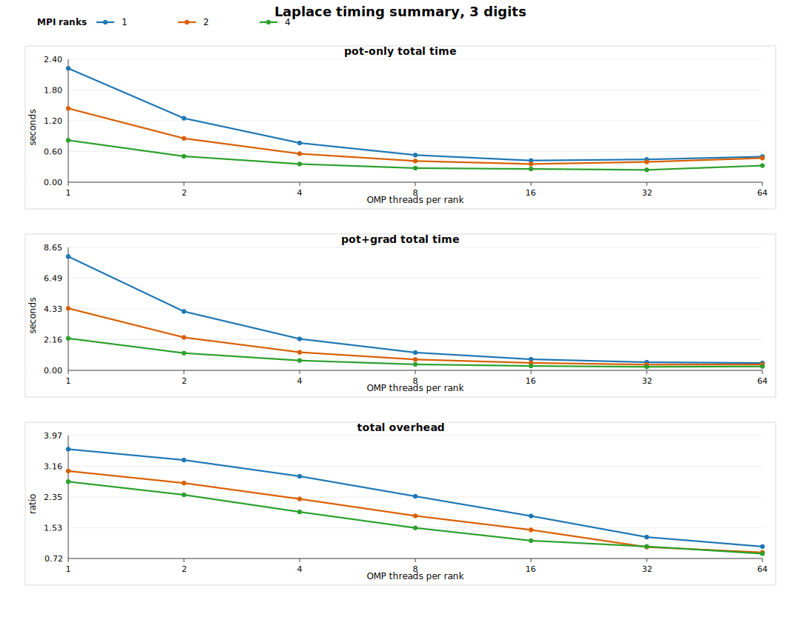
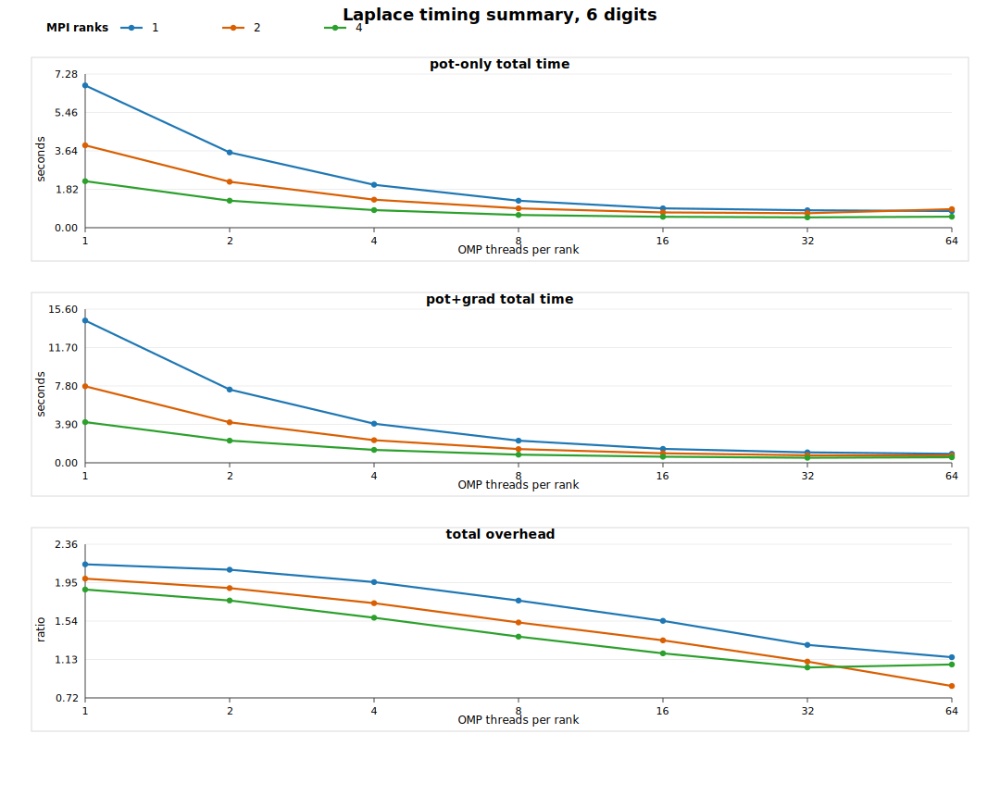
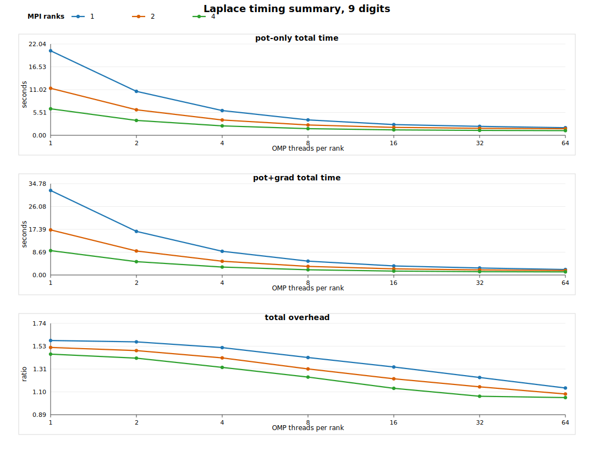
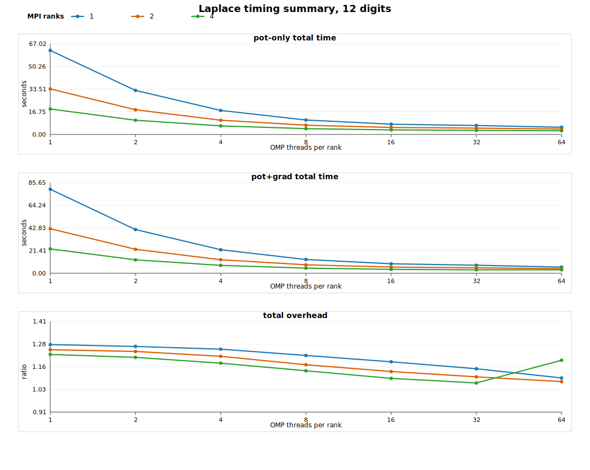

# Laplace Potential And Gradient FMM3D Benchmark Summary

**Kernel:** 3D Laplace
**Sources:** 1000000
**Targets:** 10000
**Reference:** FMM3D at eps=1.0e-14

## Notes

- This summary is derived from the same CSVs as the full benchmark report.
- Accuracy rows are merged by digits because the benchmark data shows the same accuracy across MPI/OMP settings for each digits level.
- Timing is shown as figures instead of large markdown tables.

## Accuracy

| Digits | pot src relL2 | pot trg relL2 | pot src maxRel | pot trg maxRel | grad src relL2 | grad trg relL2 | grad src maxRel | grad trg maxRel |
|---:|---:|---:|---:|---:|---:|---:|---:|---:|
| 3 | 2.072e-04 | 2.566e-04 | 1.330e+02 | 6.423e+01 | 7.288e-05 | 6.601e-05 | 2.490e-01 | 6.519e-02 |
| 6 | 2.848e-07 | 3.367e-07 | 2.788e-01 | 8.104e-02 | 1.851e-08 | 3.663e-08 | 1.002e-03 | 1.108e-04 |
| 9 | 3.298e-10 | 3.912e-10 | 5.998e-04 | 9.577e-06 | 7.404e-11 | 7.838e-11 | 5.285e-07 | 1.777e-07 |
| 12 | 3.004e-13 | 3.621e-13 | 1.978e-07 | 4.320e-08 | 3.187e-13 | 5.692e-13 | 1.197e-09 | 2.117e-10 |

## Timing Figures

### 3 Digits

### 6 Digits

### 9 Digits

### 12 Digits

## Observations

- Accuracy is invariant across MPI ranks and OMP threads in this dataset; the summary table below keeps one representative row per requested digits level after an explicit consistency check.
- Potential and gradient errors improve monotonically with digits. For example, target gradient relL2 drops from `6.601e-05` at 3 digits to `5.692e-13` at 12 digits.
- Timing overhead is most severe at low precision and low concurrency. The largest total overhead in the matrix is `3.61x` at `(digits=3, mpi=1, omp=1)`.
- At 12 digits, total overhead is much tighter, staying in the `1.07x` to `1.28x` range across the full MPI/OMP sweep.
